#  The Code Den

Welcome to **The Code Den**, a cozy, developer-inspired café website created as part of **Code Institute’s Portfolio Project 1**.  
It combines two essentials for every coder — **coffee and community**. The site provides a warm and functional space where users can explore the café’s menu, learn about the story behind The Code Den, and easily get in touch.

---

##  Table of Contents

1. [Project Goals](#project-goals)
2. [User Experience (UX)](#user-experience-ux)
3. [Features](#features)
4. [Future Enhancements](#future-enhancements)
5. [Design Choices](#design-choices)
6. [Technologies Used](#technologies-used)
7. [Testing](#testing)
8. [Bugs and Fixes](#bugs-and-fixes)
9. [Deployment](#deployment)
10. [Developer](#developer)
11. [Credits and Attributes](#credits-and-attribution)

---

##  Project Goals

- To design and build a fully responsive café website using **HTML and CSS** only.  
- To clearly communicate the site’s purpose (a café for coders).  
- To demonstrate clean, semantic HTML and maintainable CSS.  
- To create a consistent design with accessibility and usability in mind.

---

## User Experience (UX)

### Target Audience
- Developers and students looking for a comfortable place to work and relax.  
- Coffee lovers who appreciate a creative café theme.  
- Local visitors curious about the café menu or looking to get in touch.

### User Stories
- As a **visitor**, I want to understand what the café offers right away.
### Home Page
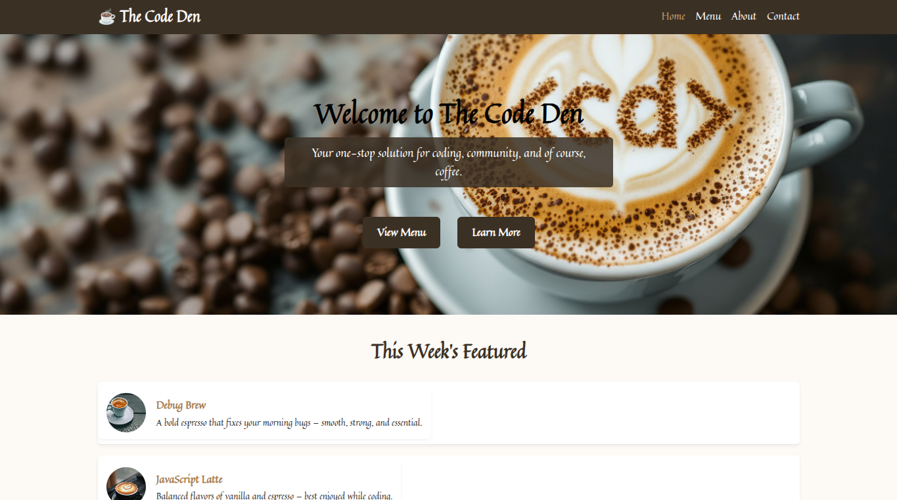

### About Page
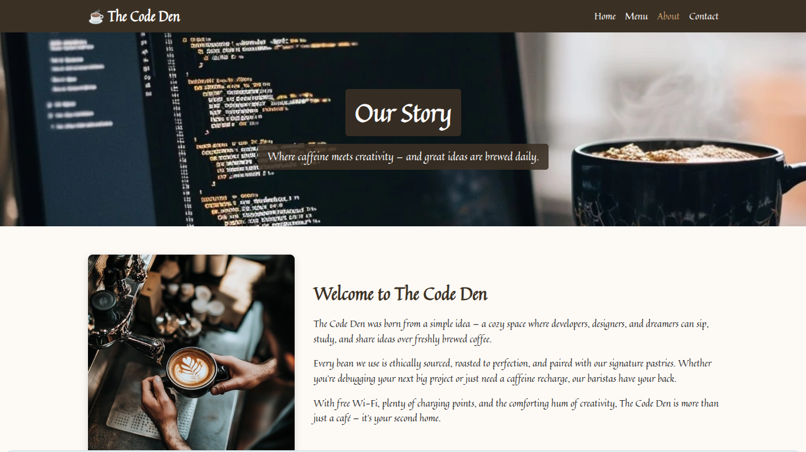

- As a **customer**, I want to browse the menu easily.
### Menu Page
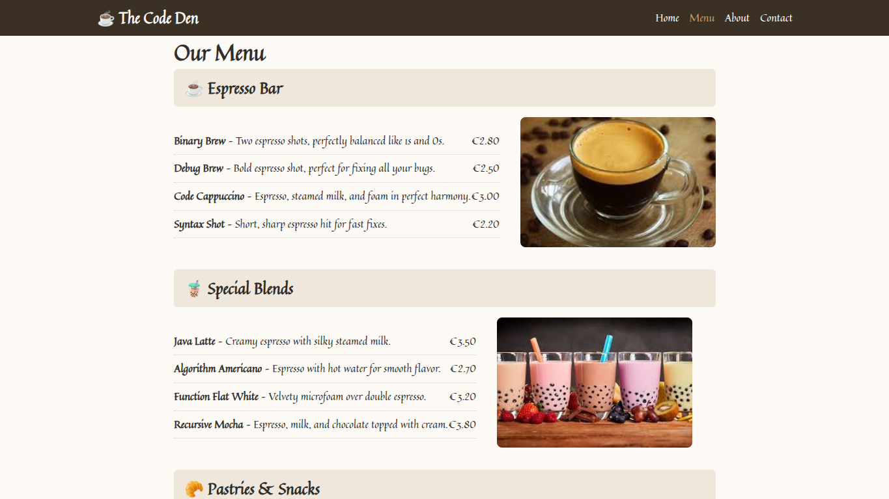

- As a **returning-visitor**, I want to contact the café through a simple form. 
### Contact Page
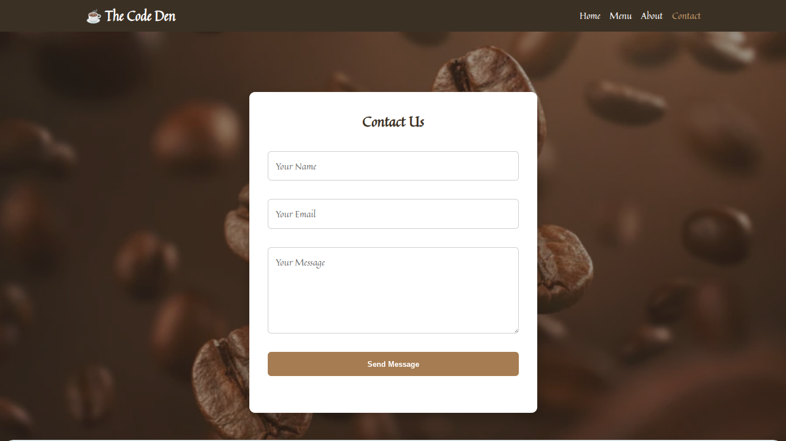

- As a **mobile user**, I want simple navigation that works well on small screens.
### Mobile Navigation
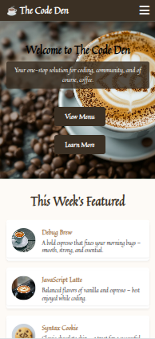

---

##  Features

### **1. Home Page (index.html)**
- Hero section with tagline and call-to-action buttons.  
- Featured menu items with hover lift and links to the full menu.  
- Responsive header and burger menu on mobile.

### **2. About Page (about.html)**
- Café story and mission.
- Wide hero image banner.
- Supporting imagery and descriptive content.

### **3. Menu Page (menu.html)**
- Categorized drinks and pastrie.  
- creative coding-themed names.
- Clear pricing and readable layout.

### **4. Contact Page (contact.html)**
- Simple contact form with user feedback.
- “Send Message” button updates when clicked.
- Accessible input fields and text area.

### **5. Navigation**

- Responsive navigation bar.

- Burger menu on mobile using CSS only.

- Active page indication.

### **6. Footer**
- Social media links (Instagram, Facebook, and X/Twitter) using Font Awesome icons.  
- Smooth hover scaling and consistent style across all pages.

---

##  Future Enhancements

- opening hours
- featured list

---

##  Design Choices

- **Color palette:** Warm coffee-inspired tones (brown, cream, gold).
- **Typography:**Quintessential (Google Fonts) for a cozy, café feel.
- **Imagery:** Optimized .webp images for performance. 
- **Layout:** Flexbox and CSS Grid for responsiveness  
- **Accessibility:** High contrast, clear hierarchy, readable font sizes.

---

## Technologies Used

- HTML5 – Semantic and accessible structure  
- CSS3 – Responsive design with Flexbox and Media Queries  
- JavaScript – Enhances contact form user feedback  
- Google Fonts – Quintessential  
- Font Awesome – Icons  
- Git & GitHub – Version control  
- GitHub Pages – Deployment  

---

## Testing

### Manual Testing

| Feature | Expected Result | Outcome | Pass |
|----------|----------------|----------|------|
| Navigation links | Navigate correctly to each page | Works as expected | |
| Burger menu | Opens and closes on mobile | Works smoothly |  |
| Hero image | Resizes correctly on all devices | Fully responsive | |
| Contact button | Changes text when clicked | Works perfectly | |
| Footer | Consistent on every page | Displays correctly |  |

### Responsive Testing
- Tested on **Chrome DevTools** across iPhone, iPad, and desktop sizes. 
- Verified on **Chrome**, **Edge**, and **Firefox** browsers.  
- Tested on  **W3c** html & css no errors
 
- **Lighthouse:** 
#### Home Page

Initial lighthouse testing :
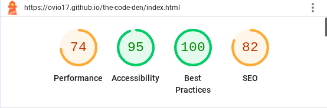 ~
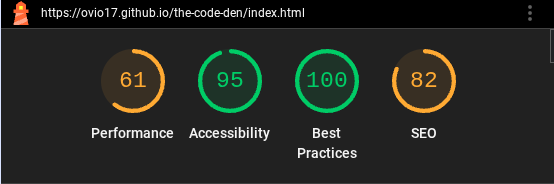

#### Menu Page

Initial lighthouse testing:
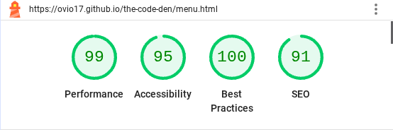 ~
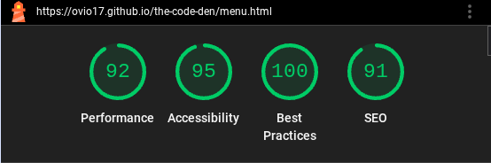

#### About Page

Initial lighthouse testing:
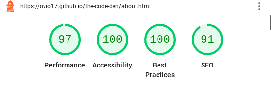 ~
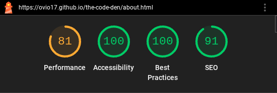

#### Contact Page

Initial lighthouse testing:
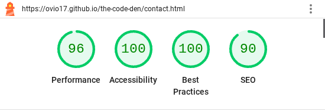 ~

---

##  Bugs and Fixes

| Issue | Cause | Fix |
|-------|--------|-----|
| Footer not at bottom | Missing layout height | Added min-height and spacing fixes |
| Burger menu missing on About | Incorrect header markup | Unified header across all pages |
| Featured section spacing | Too large image-to-text gap | Adjusted `gap` and margins |

 All known issues have been resolved and retested.

---

## Deployment

The site was deployed using **GitHub Pages**.

### Steps to Deploy
1. Log into GitHub and open the repository.
2. Navigate to **Settings**.
3. Click **Pages** in the left-hand menu.
4. Under *Source*, select:
   - Branch: `main`
   - Folder: `/ (root)`
5. Click **Save**.
6. The live site link appears at the top of the Pages section.

### Live Link
https://ovio17.github.io/the-code-den/

## Developer 
Ovie Agbofodoh

## Credits and Attribution

### Content
- All text content was written by the developer.

### Images
- Hero and featured images sourced from **Pexels** and **Unsplash**.
- Images were optimised and converted to `.webp` format for performance.

### Icons
- Icons provided by **Font Awesome**.

### Code
- Navigation and layout structure inspired by Code Institute’s
  *Love Running* and *Coffee House* walkthrough projects.

